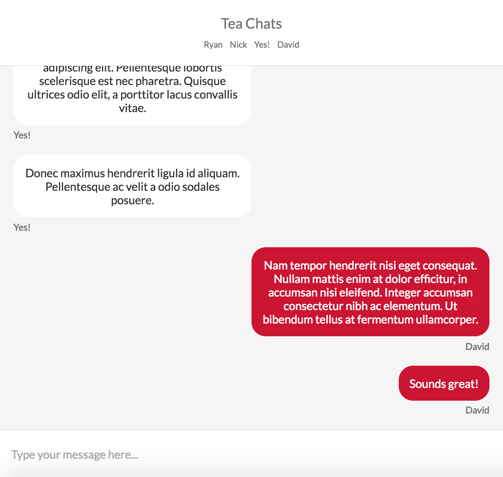
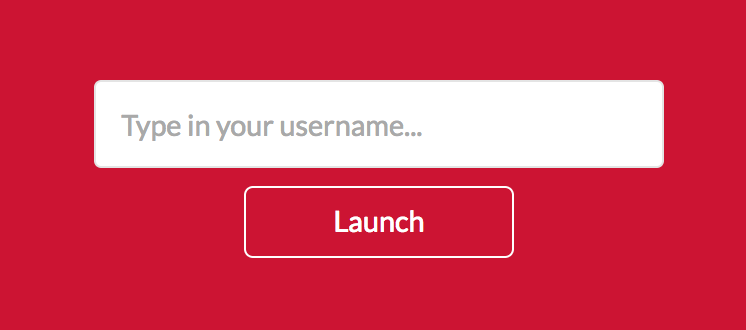

## Redux Chat

---
### Setup

0. `git clone`
0. Navigate to directory
0. `npm install`
0. In two separate Terminal tabs respectively run `npm run api-server` and `webpack -w`
0. Navigate to http://localhost:8080/

* Server can be stopped using `ctl+c`

---

### Features

#### Chat Interface



#### Chatroom Directory


#### Login Page



---
### Design

This app was built using **React.js** for view rendering and **Redux.js** for state management

### State

Arguably the most important design implementation was the state shape:

```js
{
  user: "David",
  rooms: [],
  currentRoom: {
    id: 0,
    name: 'Tea Chats',
    users: ['Ryan', 'Nick']
  },
  messages: [
    {name: 'Ryan', message: 'ayyyyy'},
    {name: 'Nick', message: 'lmao'}
  ]
}
```

* `user` -- A string identify the current logged in user
* `rooms` -- An array of room objects with `name` and `id` attributes -- this list is shown in the chatroom directory
* `currentRoom` -- An object identifying the actively shown chatroom, coupled with `id`, `name`, and `users` attributes
* `messages` -- An array of message objects containing all messages within the current room

I opted for a flat state to ensure concise Redux reducers and prevent components from unneeded re-rendering. Having concise reducers is extremely important because it will reduce the risk of directly mutating our old state. In order for a Redux reducer to decide if there have been changes in state, it compares the location in memory between the old state and new state. If our code ever directly mutates the old state then our old state and new state's memory location will be the same, forcing the reducer to return the old state by default and cause no change in our components.

### Components

```
Root
  Login
  Chat
    Directory
      Room
      User
    Messages
      RoomInfo
      Log
```

* `Login` -- Logs in username and redirects to the Chat component upon username submission
* `Chat` -- An entry point. onEnter, fetches all needed data from our application API
* `Directory` -- Renders a list of chatrooms and information about the current user
* `Room` -- A list of all chatrooms. onClick, allows the user to navigate to other rooms
* `User` -- Displays user information such as `name` and online duration
* `Messages` -- The component simply wraps the Log and RoomInfo Components
* `RoomInfo` -- Displays the name of the current chatroom and a list of users whom have posted a message

---

### Overall Approach

My initial application flow is to log in a user and save the user's name within localStorage. Then, fetch all needed data from my application API before rendering the chat interface. I then built a listener such that every time my application state changes, the appropriate component re-renders. The chat interface provides a UI that allows the user to navigate between chatrooms and post messages within those chatrooms. If a user tries to navigate to the '/chat' route without logging in, they will be redirected back to the index route login page.

Because I saved the current user's info in the browser's localStorage API, the user can leave the chat interface and upon navigation back to the application's /chat route, the user will still be logged in.

In order to improve readability and testability, I opted to use small, stateless components as much as possible. The components are pure. Passing the same data in, will result in the same data out and because of their small size, these components are easily reusable.

### Future Improvements

[] A proper database would allow all messages, user, and room data to persist even when the application server restarts. (MongoDB, PostgreSQL)

[] Web sockets - Right now, the user would have to refresh their browser in order to witness any changes to the message log from other users. Implementing a web socket would open up a direct connection between the server and the client. It would listen for specific action changes and dispatch those changes to all current open connections. (Socket.io)

[] A redirect to the '/chat' route if a user navigates to the index route and is logged in. I will need to implement a logout function that would destroy the user item within localStorage and redirect a user to the login page to ensure the user won't be stuck in a logged in state.

[] In the apps current setup, all chatroom specific messages are acquired upon entrance. This is a costly maneuver and does not scale well. Large scale chat applications like Slack, can quickly can very quickly reach message counts well over 100,000 and we don't want to have to create an html element for every single message at this scale -- O(n). One solution would be to implement an infinite scroll within the message log. A finite number of messages would be fetched from our database upon initial load. Then, a scroll waypoint location would be identified. Once the scroll rolls past this waypoint location, an action would be dispatched to acquire more messages.

[] Refactor! Some of my few stateful components should and will be be refactored into stateless components by integrating their state into the application state as a whole. I'll then utilize higher-order components to distribute this state. Doing this will further improve the testability and readability of this application.
